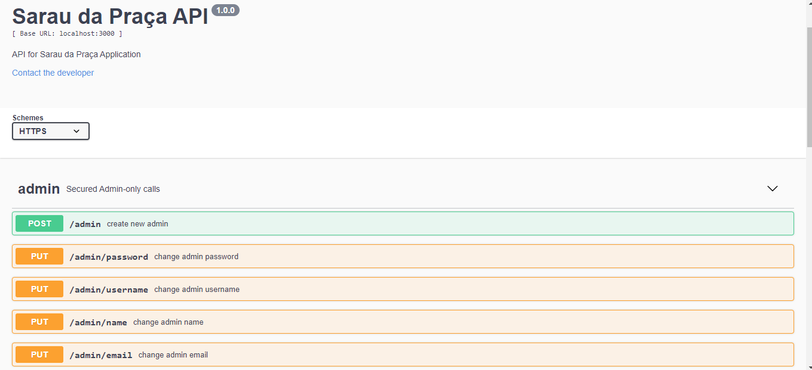

## Sarau da praça API
- [Overview](#overview)
- [Requirements](#requirements)
- [Installation](#installation)
- [Documentation](#documentation)
- [Tests](#tests)
- [Run server](#run-server)
- [Documentation](#documentation)

## Overview

API built on Node.JS. It's a RESTful API for a WEB and mobile applications for management a cultural event and subscription of participants. 

## Requirements

- **[Node.js](https://www.nodejs.org/)** (supported versions: 10.x.x)
- **[MYSQL](https://www.mysql.com/)**

## Installation

### MySQL Configuration
1. create "sarauapidevelopment"
2. create "sarauapitest"

### Env variables
1. create `.env` file like `.env.example`
2. change in this file settings for a authentication to locally database
3. besides including gmail settings you make this changes in gmail configuration(Google Account -> Security)


### Install all dependencies
```bash
$ npm install 
```

## Tests
you can run tests for
```bash
$ npm run test
```

## Run server
```bash
$ npm run dev
```

## Documentation
Documentation is present after run server, in **localhost:{PORT}/docs** and you see this:
